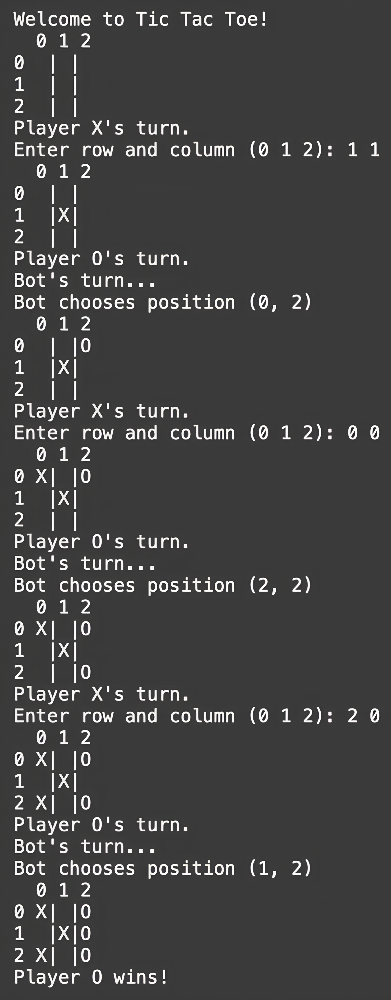

# Tic-Tac-Toe Game

This is a Python implementation of a simple Tic-Tac-Toe game, where a player can play against a bot. The bot employs an intelligent strategy to make moves, including blocking the opponent and taking the most favorable available move. The game is played on a 3x3 grid, and the player alternates with the bot, starting with player "X."

---

## Features

- **Two-Player Gameplay**: Play as Player "X" while the bot plays as Player "O."
- **Bot AI**: The bot uses a strategy to make decisions:
  - It tries to win if it can in the next move.
  - It blocks the opponent from winning if the opponent has a winning move.
  - It selects the best available move by scoring spots based on open lines (rows, columns, diagonals).
- **Interactive Console Input**: Enter the row and column (0-2) to make your move.
- **Game End Detection**: The game detects if there is a winner or if it’s a draw.

---

## Installation

To run the Tic Tac Toe game, follow these steps:

1. **Clone the repository** or download the `tic_tac_toe.py` file.
2. **Run the game** using Python 3:

```bash
git clone https://github.com/140d/tic-tac-toe.git
cd tic-tac-toe
python tic_tac_toe.py
```

## How to Play
- Start the game by running the script. The bot will be "O," and you will be "X."
- On your turn, you will be prompted to enter the row and column of the cell you want to place your "X" (e.g., 0 1 for the top-middle cell).
- The bot will take its turn after you, choosing a cell for "O" based on its strategy.
- The game will continue until either:
  - You or the bot wins.
  - The game ends in a draw (when all cells are filled with no winner).
- The game will display the winner or indicate a draw at the end.

## Game Flow
- Player's Turn (X): You are prompted to input the row and column number where you want to place your mark ("X").
- Bot's Turn (O): The bot automatically places its mark using a smart strategy.
- Winning or Draw Check: After each move, the game checks for a winner or draw and prints the result.

## Code Structure
- TicTacToe Class:
  - Handles the game logic, board management, and player moves.
  - Contains functions to check for a winner, evaluate available moves, and simulate the bot’s decisions.
- Methods:
  - `__init__`: Initializes the game board and sets the starting player.
  - `print_board`: Displays the current board on the screen.
  - `is_valid_move`: Checks if a move is valid (if the cell is empty).
  - `make_move`: Places the player's symbol on the board and switches turns.
  - `check_winner`: Checks if there's a winner or if the game is a draw.
  - `get_winning_move`: Looks for a move that leads to a win for the player.
  - `count_available_lines`: Counts how many lines a particular cell can contribute to.
  - `get_bot_move`: Determines the bot's next best move based on the current board state.
  - `play`: Main function to run the game loop.
 

## Example Gameplay
Here is how the game is played from the console:



## Contributions
Feel free to fork this repository, improve the AI, or fix any bugs. If you make improvements, please create a pull request, and I will review it.
